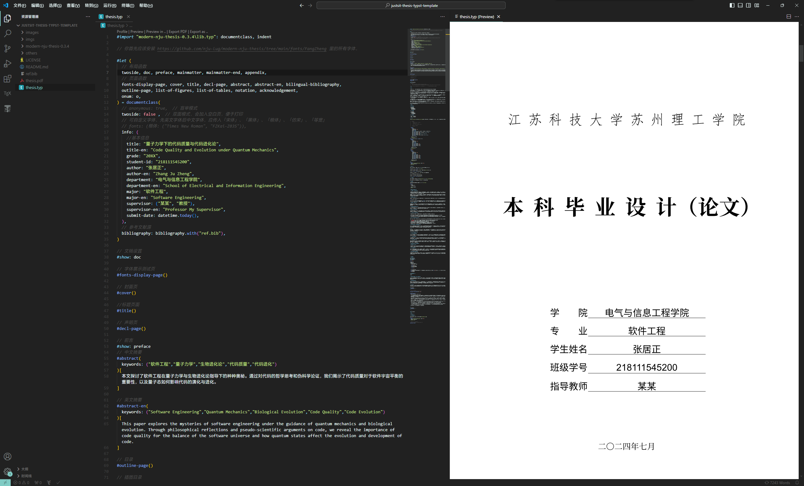
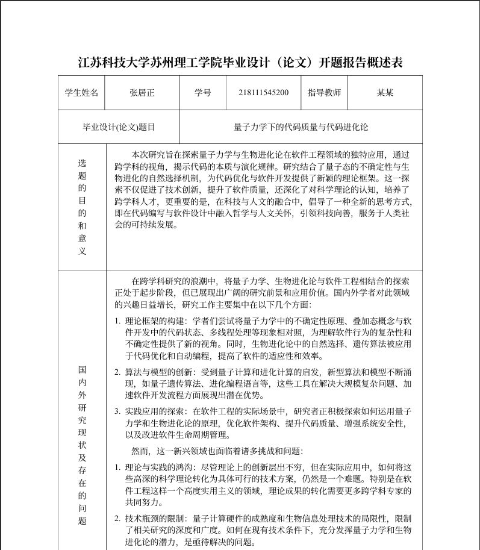

# 苏理工学位论文typst模板 justsit-thesis-typst-template

基于苏理工论文参考格式修改完善的 Typst 模板，能够简洁、快速、持续生成 PDF 格式的毕业论文。


[Typst中文教程](https://typst-doc-cn.github.io/tutorial/introduction.html)


也可以参考 [Typst 中文文档网站](https://typst-doc-cn.github.io/docs/) 迅速入门。


## 使用

**重要！！！非官方文档，可能存在老师不认可的风险！！**

快速浏览效果: 查看 `thesis.pdf`，样例论文源码：查看 `thesis.typ`

**你只需要修改 `thesis.typ` 文件即可，基本可以满足你的所有需求。**

如果你认为不能满足你的需求，可以先查阅后面的 [Q&A](#qa) 部分。


### VS Code 本地编辑（推荐）

1. 在 VS Code 中安装 [Tinymist Typst](https://marketplace.visualstudio.com/items?itemName=myriad-dreamin.tinymist) 和 [Typst Preview](https://marketplace.visualstudio.com/items?itemName=mgt19937.typst-preview) 插件。前者负责语法高亮和错误检查等功能，后者负责预览。
    - 也推荐下载 [Typst Companion](https://marketplace.visualstudio.com/items?itemName=CalebFiggers.typst-companion) 插件，其提供了例如 `Ctrl + B` 进行加粗等便捷的快捷键。
    - 你还可以下载[南京大学学位论文](https://github.com/nju-lug/modern-nju-thesis?tab=readme-ov-file)作者开发的 [Typst Sync](https://marketplace.visualstudio.com/items?itemName=OrangeX4.vscode-typst-sync) 和 [Typst Sympy Calculator](https://marketplace.visualstudio.com/items?itemName=OrangeX4.vscode-typst-sympy-calculator) 插件，前者提供了本地包的云同步功能，后者提供了基于 Typst 语法的科学计算器功能。
2. 用 VS Code 打开下载好的目录，打开 `thesis.typ` 文件，并按下 `Ctrl + K V` 进行实时编辑和预览。



### 特性 / 路线图

- **说明文档**
    - [ ] 暂时参考样文列出内容，或查看[南京大学学位论文](https://github.com/nju-lug/modern-nju-thesis?tab=readme-ov-file)以了解详细
- **类型检查**
    - [ ] 应该对所有函数入参进行类型检查，及时报错
- **全局配置**
    - [x] 类似 LaTeX 中的 `documentclass` 的全局信息配置
    - [x] **盲审模式**，将个人信息替换成小黑条，并且隐藏致谢页面，论文提交阶段使用 
    - [x] **双面模式**，会加入空白页，便于打印
    - [x] **自定义字体配置**，可以配置「宋体」、「黑体」与「楷体」等字体对应的具体字体
    - [x] **数学字体配置**：模板不提供配置，用户可以自己使用 `#show math.equation: set text(font: "Fira Math")` 更改
- **模板**
    - [x] 字体测试页
    - [x] 封面
    - [x] 论文标题页
    - [x] 声明页
    - [x] 中文摘要
    - [x] 英文摘要
    - [x] 目录页
    - [x] 插图目录
    - [x] 表格目录
    - [x] 符号表
    - [x] 致谢
- **编号**
    - [x] 前言使用罗马数字编号
    - [x] 附录使用罗马数字编号
    - [x] 表格使用 `1-1` 格式进行编号
    - [x] 数学公式使用 `(1-1)` 格式进行编号
    - [x] 三级标题下的编号按如此顺序：1）；（1）；①

- **环境**
    - [ ] 定理环境（这个也可以自己使用第三方包配置）
- **其他文件**
    - [x] 本科生开题报告
    - [ ] 本科生任务书
    - [ ] 中期检查报告


## 其他文件

还实现了本科生的开题报告，只需要预览和编辑 `others` 目录下的文件即可。（一般般完善）




## Q&A

### 我不会 LaTeX，可以用这个模板写论文吗？

可以。

如果你不关注模板的具体实现原理，你可以用 Markdown Like 的语法进行编写，只需要按照模板的结构编写即可。


### 我不会编程，可以用这个模板写论文吗？

同样可以。

如果仅仅是当成是入门一款类似于 Markdown 的语言，相信使用该模板的体验会比使用 Word 编写更好。


### 为什么我的字体没有显示出来，而是一个个「豆腐块」？

这是因为本地没有对应的字体，**这种情况经常发生在 MacOS 的「楷体」显示上**。

你应该安装本目录下的 `fonts` 里的所有字体，里面包含了可以免费商用的「方正楷体」和「方正仿宋」，然后再重新渲染测试即可。

你可以使用 `#fonts-display-page()` 显示一个字体渲染测试页面，查看对应的字体是否显示成功。

如果还是不能成功，你可以按照模板里的说明自行配置字体，例如

```typst
#let (...) = documentclass(
  fonts: (楷体: ("Times New Roman", "FZKai-Z03S")),
)
```

先是填写英文字体，然后再填写你需要的「楷体」中文字体。

**字体名称可以通过 `typst fonts` 命令查询。**

如果找不到你所需要的字体，可能是因为 **该字体变体（Variants）数量过少**，导致 Typst 无法识别到该中文字体。


### 学习 Typst 需要多久？

一般而言，仅仅进行简单的编写，不关注布局的话，你可以打开模板就开始写了。

如果你想进一步学习 Typst 的语法，例如如何排篇布局，如何设置页脚页眉等，一般只需要几个小时就能学会。

如果你还想学习 Typst 的「[元信息](https://typst-doc-cn.github.io/docs/reference/meta/)」部分，进而能够编写自己的模板，一般而言需要几天的时间阅读文档，以及他人编写的模板代码。

如果你有 Python 或 JavaScript 等脚本语言的编写经验，了解过函数式编程、宏、样式、组件化开发等概念，入门速度会快很多。


### 为什么只有一个 thesis.typ 文件，没有按章节分多个文件？

因为 Typst **语法足够简洁**、**编译速度足够快**、并且 **拥有光标点击处双向链接功能**。

语法简洁的好处是，即使把所有内容都写在同一个文件，你也可以很简单地分辨出各个部分的内容。

编译速度足够快的好处是，你不再需要像 LaTeX 一样，将内容分散在几个文件，并通过注释的方式提高编译速度。

光标点击处双向链接功能，使得你可以直接拖动预览窗口到你想要的位置，然后用鼠标点击即可到达对应源码所在位置。

还有一个好处是，单个源文件便于同步和分享。

即使你还是想要分成几个章节，也是可以的，Typst 支持你使用 `#import` 和 `#include` 语法将其他文件的内容导入或置入。你可以新建文件夹 `chapters`，然后将各个章节的源文件放进去，然后通过 `#include` 置入 `thesis.typ` 里。


### 我如何更改页面上的样式？具体的语法是怎么样的？

理论上你并不需要更改 `resources` 目录下的任何文件，无论是样式还是其他的配置，你都可以在 `thesis.typ` 文件内修改函数参数实现更改。具体的更改方式可以阅读 `resources` 目录下的文件的函数参数。

例如，想要更改页面边距为 `50pt`，只需要将

```typst
#show: doc
```

改为

```typst
#show: doc.with(margin: (x: 50pt))
```

即可。


## 开发者指南

### template 目录

- `thesis.typ` 文件: 你的论文源文件，可以随意更改这个文件的名字，甚至你可以将这个文件在同级目录下复制多份，维持多个版本。
- `ref.bib` 文件: 用于放置参考文献。
- `images` 目录: 用于放置图片。


### 内部目录（.\resources下）

- `utils` 目录: 包含了模板使用到的各种自定义辅助函数，存放没有外部依赖，且 **不会渲染出页面的函数**。
- `pages` 目录: 包含了模板用到的各个 **独立页面**，例如封面页、声明页、摘要等，即 **会渲染出不影响其他页面的独立页面的函数**。
- `layouts` 目录: 布局目录，存放着用于排篇布局的、应用于 `show` 指令的、**横跨多个页面的函数**，例如为了给页脚进行罗马数字编码的前言 `preface` 函数。
  - 主要分成了 `doc` 文稿、`preface` 前言、`mainmatter` 正文与 `appendix` 附录/后记。
- `lib.typ`:
  - **职责一**: 作为一个统一的对外接口，暴露出内部的 utils 函数。
  - **职责二**: 使用 **函数闭包** 特性，通过 `documentclass` 函数类进行全局信息配置，然后暴露出拥有了全局配置的、具体的 `layouts` 和 `pages` 内部函数。


## 致谢

- 感谢 [@OrangeX4](https://github.com/OrangeX4) 开发的 [南京大学学位论文](https://github.com/nju-lug/modern-nju-thesis?tab=readme-ov-file) Typst 模板


## License

This project is licensed under the MIT License.
